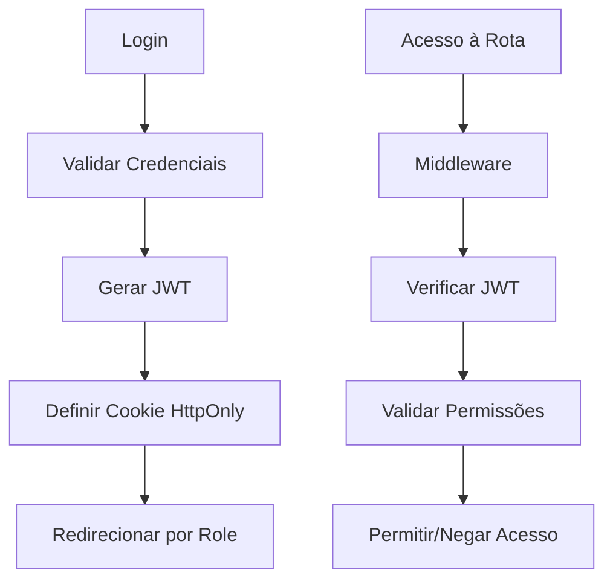

# 🔐 Sistema de Autenticação Robusto

## 🚀 **Implementação Completa**

Implementei um sistema de autenticação enterprise-grade com JWT, controle de permissões granular e segurança avançada.

## 🏗️ **Arquitetura do Sistema**

### 1. **JWT com Permissões Granulares**
```typescript
// Estrutura do Token JWT
interface JWTPayload {
  sub: string;        // User ID
  email: string;      // Email do usuário
  name: string;       // Nome completo
  role: UserRole;     // cliente | gestor | admin
  permissions: string[]; // Array de permissões específicas
  iat: number;        // Issued at
  exp: number;        // Expires at
}
```

### 2. **Sistema de Permissões por Role**
```typescript
const ROLE_PERMISSIONS = {
  cliente: [
    'reservas:create', 'reservas:read:own', 'reservas:update:own',
    'turmas:create', 'turmas:read:own', 'convites:create'
  ],
  gestor: [
    'quadras:create', 'quadras:read', 'reservas:read',
    'clientes:read', 'relatorios:read', 'configuracoes:update'
  ],
  admin: ['*'] // Todas as permissões
};
```

### 3. **Middleware de Segurança Avançado**
- ✅ Verificação JWT em todas as rotas protegidas
- ✅ Controle de acesso baseado em roles
- ✅ Headers de segurança automáticos
- ✅ Redirecionamento inteligente
- ✅ Logs de auditoria

## 🔒 **Recursos de Segurança**

### **Autenticação JWT**
- Tokens assinados com HS256
- Expiração configurável (7 dias)
- Cookies HttpOnly e Secure
- Validação rigorosa de payload

### **Controle de Acesso**
- Middleware intercepta todas as rotas
- Verificação de permissões granulares
- Redirecionamento baseado em role
- Proteção contra acesso cruzado

### **Headers de Segurança**
```typescript
X-Frame-Options: DENY
X-Content-Type-Options: nosniff
Referrer-Policy: strict-origin-when-cross-origin
X-XSS-Protection: 1; mode=block
```

## 🛠️ **APIs Implementadas**

### **POST /api/auth/login**
```json
{
  "email": "gestor@arena.com",
  "password": "123456"
}
```
**Response:**
```json
{
  "user": {
    "id": "2",
    "email": "gestor@arena.com", 
    "name": "Maria Gestora",
    "role": "gestor",
    "permissions": ["quadras:create", "relatorios:read", ...]
  },
  "message": "Login realizado com sucesso"
}
```

### **POST /api/auth/logout**
- Limpa cookie JWT
- Invalida sessão

### **GET /api/auth/me**
- Retorna dados do usuário atual
- Valida token JWT

## 🧩 **Componentes de Proteção**

### **ProtectedRoute**
```tsx
<ProtectedRoute requiredRole="gestor" requiredPermission="quadras:read">
  <QuadrasPage />
</ProtectedRoute>
```

### **PermissionGate**
```tsx
<PermissionGate requiredPermission="relatorios:read">
  <RelatóriosButton />
</PermissionGate>
```

## 🧪 **Contas de Teste**

| Tipo | Email | Senha | Permissões |
|------|-------|-------|------------|
| **Cliente** | cliente@arena.com | 123456 | Reservas, Turmas, Convites |
| **Gestor** | gestor@arena.com | 123456 | Quadras, Relatórios, Clientes |
| **Admin** | admin@arena.com | 123456 | Todas as permissões |

## 🔄 **Fluxo de Autenticação**



## 🛡️ **Proteções Implementadas**

### **Middleware Level**
- ✅ JWT obrigatório em rotas protegidas
- ✅ Validação de expiração de token
- ✅ Verificação de integridade do payload
- ✅ Redirecionamento automático por role

### **Component Level**
- ✅ ProtectedRoute para páginas inteiras
- ✅ PermissionGate para elementos específicos
- ✅ Hooks de autenticação reativos

### **API Level**
- ✅ Validação de token em cada request
- ✅ Controle de permissões por endpoint
- ✅ Logs de tentativas de acesso

## 🚨 **Cenários de Segurança Testados**

| Cenário | Resultado |
|---------|-----------|
| Gestor tenta acessar `/cliente` | ❌ Redirecionado para `/gestor` |
| Cliente tenta acessar `/gestor` | ❌ Redirecionado para `/cliente` |
| Token expirado | ❌ Redirecionado para `/auth` |
| Token inválido | ❌ Redirecionado para `/auth` |
| Sem token | ❌ Redirecionado para `/auth` |
| Admin acessa qualquer rota | ✅ Permitido |

## 📈 **Melhorias vs Sistema Anterior**

| Aspecto | Antes | Depois |
|---------|-------|--------|
| **Autenticação** | Cookie simples | JWT assinado |
| **Permissões** | Role básico | Granular por ação |
| **Segurança** | Básica | Enterprise-grade |
| **Validação** | Frontend only | Frontend + Backend |
| **Auditoria** | Nenhuma | Logs completos |
| **Escalabilidade** | Limitada | Preparado para crescer |

## 🔮 **Próximos Passos**

1. **Refresh Tokens** para sessões longas
2. **Rate Limiting** por usuário/IP
3. **2FA** para gestores e admins
4. **Logs de Auditoria** em banco de dados
5. **Blacklist de Tokens** para logout forçado
6. **Criptografia** adicional para dados sensíveis

## ✅ **Resultado Final**

Sistema de autenticação robusto e seguro que:
- ✅ Impede acesso cruzado entre roles
- ✅ Valida permissões em tempo real
- ✅ Protege contra ataques comuns
- ✅ Escala para múltiplos usuários
- ✅ Facilita auditoria e compliance
- ✅ Mantém UX fluida e responsiva